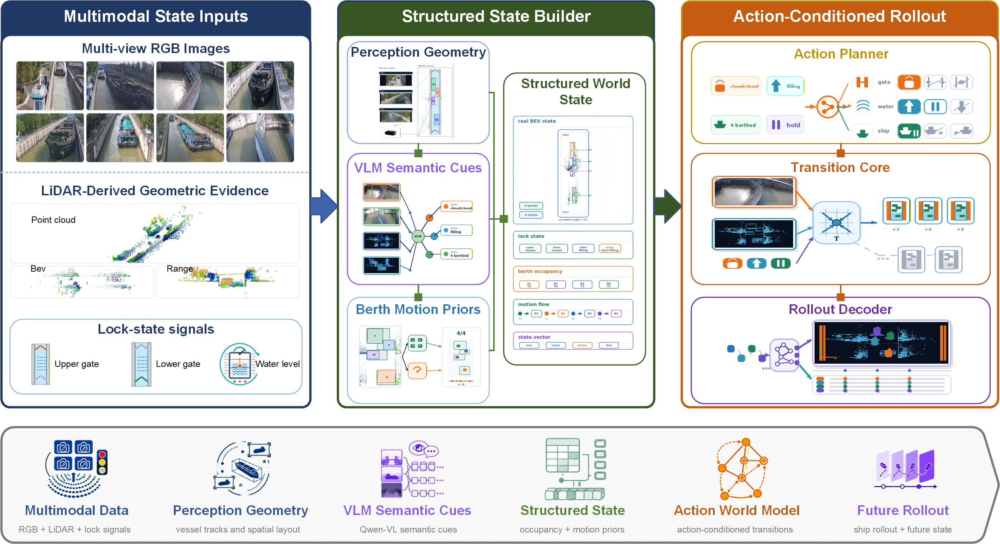

# NavLock-World

**NavLock-World: Action-Conditioned Structured World Modeling for Navigation-Lock Operation**

NavLock-World is the official paper repository for structured world modeling in
navigation-lock operation. The goal is to convert fixed multimodal observations
and online lock-state signals into an auditable current state, evaluate
candidate lock-operation actions, and roll the state forward over future
horizons.



## Highlights

- **Structured world model for navigation locks.** The model represents gate
  state, water state, berth occupancy, vessel motion flow, action validity, and
  action-conditioned future state.
- **Multimodal evidence.** NavLock-World combines multi-view RGB images, LiDAR
  geometry, online lock-state signals, VLM semantic cues, and lock-specific
  geometry priors.
- **NavLock-HY dataset interface.** The code expects a nuScenes-style
  navigation-lock dataset and additional lock-specific annotations.
- **Paper-facing release.** This repository contains curated source code,
  configs, scripts, tests, and selected paper figures. Data, model weights,
  outputs, paper LaTeX sources, and private development notes are not included.

## Repository Layout

```text
configs/        Selected paper configs for VLM and RTMDet 2D perception
docs/           Dataset/model notes and paper figures for the repository page
navlock_world/  Core dataset, geometry, world-state, and training utilities
scripts/        Training and evaluation entry points
tools/          Data conversion, label construction, fusion, and evaluation tools
tests/          Regression tests for paper pipeline components
```

## Installation

The development environment used in the paper is a Conda environment named
`NavLock-World`.

```bash
conda create -n NavLock-World python=3.10 -y
conda activate NavLock-World
pip install -r requirements.txt
```

The RTMDet detector uses MMDetection components. Hydro3DNet is treated as a
separate 3D detector backend; install its external dependencies according to
the detector instructions before running the corresponding training scripts.

## Data

NavLock-HY is not included in this repository. Place the dataset at `data/` or
create a symlink:

```bash
ln -s /path/to/NavLock-HY data
```

Expected data:

- nuScenes-style metadata and calibrated multi-sensor samples;
- eight fixed camera streams and four LiDAR streams;
- 2D/3D perception annotations;
- lock-specific labels for gate state, water state, water levels, berth layout,
  vessel intention, action validity, observed operation, and future-state
  supervision.

See [docs/DATASET.md](docs/DATASET.md) for the expected structure.

## Model Weights

Large model weights are not included. Put local weights under `models/`, for
example:

```text
models/Qwen3-VL-4B-Instruct/
models/Qwen3-VL-8B-Instruct/
```

See [docs/MODEL_ZOO.md](docs/MODEL_ZOO.md) for model notes.

## Core Pipeline

Build scene-level temporal indexes:

```bash
PYTHONPATH=. python tools/build_navlock_sequences.py \
  --data-root data \
  --out-dir data/navlock_sequences
```

Build VLM semantic instruction data:

```bash
PYTHONPATH=. python tools/build_vlm_semantic_instruction_data.py \
  --data-root data \
  --split train \
  --task-mode prediction
```

Convert VLM semantic data to Qwen3-VL messages:

```bash
PYTHONPATH=. python tools/convert_vlm_semantic_to_qwen3vl.py \
  --input outputs/vlm_semantic/navlock_vlm_semantic_train.jsonl \
  --output outputs/vlm_semantic/qwen3vl_8b/navlock_qwen3vl_8b_train.jsonl \
  --model Qwen/Qwen3-VL-8B-Instruct \
  --max-images 4 \
  --max-lidar-images 2
```

Train the Qwen3-VL semantic branch with LoRA:

```bash
PYTHONPATH=. python scripts/train_qwen3vl_lora_smoke.py \
  --config configs/qwen3vl_8b_lora_unified.yaml
```

Build the deployable fused world-state baseline:

```bash
PYTHONPATH=. python tools/build_deployable_fused_baseline.py \
  --eval-splits val,test \
  --data-root data \
  --output outputs/fused_deployable_baseline/predictions_val_test.jsonl \
  --summary-output outputs/fused_deployable_baseline/summary_val_test.json
```

## Main Paper Figures

Selected paper figures are available under `docs/figures/`:

- `framework.png`: overall NavLock-World framework;
- `navlock_structured_state_builder.png`: structured state construction;
- `action_transition_core.png`: action planner and transition core;
- `rollout_decoder.png`: action-conditioned rollout decoder;
- `navlock_real_world_case_study.png`: real-world case study.

## Citation

If you find this repository useful, please cite the preprint:

```bibtex
@misc{lu2026navlockworld,
  title   = {NavLock-World: Action-Conditioned Structured World Modeling for Navigation-Lock Operation},
  author  = {Lu, Xiaodong and others},
  year    = {2026},
  note    = {Manuscript under review}
}
```

## License

This repository is released under the MIT License. See `LICENSE` for details.
