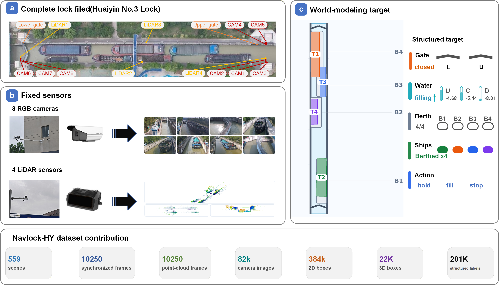

# NavLock-HY Dataset

NavLock-HY is a fixed-infrastructure multimodal dataset for navigation-lock
world modeling. The data were collected at Huaiyin No. 3 Navigation Lock in
Huai'an, Jiangsu Province, China. The dataset follows the nuScenes-style data
organization and adds labels that are specific to lock operation, including
gate state, water state, water levels, berth layout, vessel motion, operation
actions, and future-state targets.



The dataset is not stored in this GitHub repository. This repository only
contains the paper code, dataset interface, scripts, tests, and selected paper
figures.

## Download

The full dataset is released on Hugging Face Datasets as split archive parts
with download instructions and SHA256 checksums.

| Resource | Link | Status |
|---|---|---|
| Full NavLock-HY dataset | [Hugging Face Datasets: serendipitylxd/NavLock-HY](https://huggingface.co/datasets/serendipitylxd/NavLock-HY) | Available |
| DOI archive | To be added after DOI assignment | Pending |

After downloading, place the dataset at `data/` or create a symlink:

```bash
ln -s /path/to/NavLock-HY data
```

## Dataset Scale

The current release package is expected to contain about 86 GB of data. The
sample directory is the main component, with 10,250 synchronized frames per
sensor folder.

| Component | Approx. size |
|---|---:|
| Multi-sensor samples | 84 GB |
| nuScenes-style metadata | 116 MB |
| 2D annotations | 137 MB |
| Structured sequence files | 413 MB |
| Info files | 210 MB |

The sample files include eight fixed camera streams and LiDAR point-cloud data:

| Sensor folder | Files |
|---|---:|
| `CAM_1`--`CAM_8` | 82,000 PNG images |
| `LIDAR_TOP` | 10,250 binary point-cloud files |

In the paper setting, the physical sensing system contains eight fixed cameras
and four fixed LiDAR units. The public package uses a nuScenes-style interface;
when multiple LiDAR units are fused or represented through one release channel,
the release manifest describes the mapping from physical sensors to stored
sample channels.

## Data Layout

The expected root directory is:

```text
data/
├── v1.0-trainval/
│   ├── sample.json
│   ├── sample_data.json
│   ├── sensor.json
│   ├── calibrated_sensor.json
│   ├── sample_annotation.json
│   └── ...
├── samples/
│   ├── CAM_1/
│   ├── CAM_2/
│   ├── ...
│   ├── CAM_8/
│   └── LIDAR_TOP/
├── sweeps/
├── splits/
│   ├── train_scenes.txt
│   ├── val_scenes.txt
│   └── test_scenes.txt
├── 2d_annotations/
│   ├── instances_train.json
│   ├── instances_val.json
│   └── instances_test.json
├── infos/
└── navlock_sequences/
```

## Annotations

NavLock-HY keeps standard perception annotations and adds operation-specific
state fields that are needed for world modeling in navigation locks.

Standard perception fields include:

- calibrated multi-sensor samples;
- 2D object annotations for camera perception;
- 3D vessel annotations and point-cloud based geometry;
- scene, sample, instance, ego-pose, and calibration metadata.

Navigation-lock-specific fields include:

- upper-gate and lower-gate state;
- chamber, upstream, and downstream water levels;
- water-transition phase;
- ideal berth layout and berth occupancy;
- vessel intention and vessel motion flow;
- valid/invalid operation-action masks;
- invalid-action reasons;
- observed operation;
- action-conditioned future gate, water, and vessel-rollout targets.

## Splits

The release follows fixed scene-level train/validation/test splits. Frames from
one scene are assigned to only one split, so the same lockage sequence does not
appear across training and evaluation splits.

```text
train: 459 scenes, 8463 frames
val:    50 scenes,  919 frames
test:   50 scenes,  868 frames
```

## Rebuilding Sequence Files

If the nuScenes-style metadata and raw samples are available, the structured
sequence files can be rebuilt with:

```bash
PYTHONPATH=. python tools/build_navlock_sequences.py \
  --data-root data \
  --out-dir data/navlock_sequences
```

Other derived labels and evaluation files can be regenerated with the scripts
under `tools/`. See the repository README for the main paper pipeline.

## Release Notes

- The dataset contains fixed-site navigation-lock observations rather than
  ego-vehicle driving sequences.
- The labels include lock-operation variables that do not exist in standard
  autonomous-driving datasets, such as water-level state, gate state, ideal
  berths, vessel-flow state, operation validity, and future lock-state targets.
- The complete dataset, checksums, and release manifest are provided through
  the Hugging Face dataset release.
